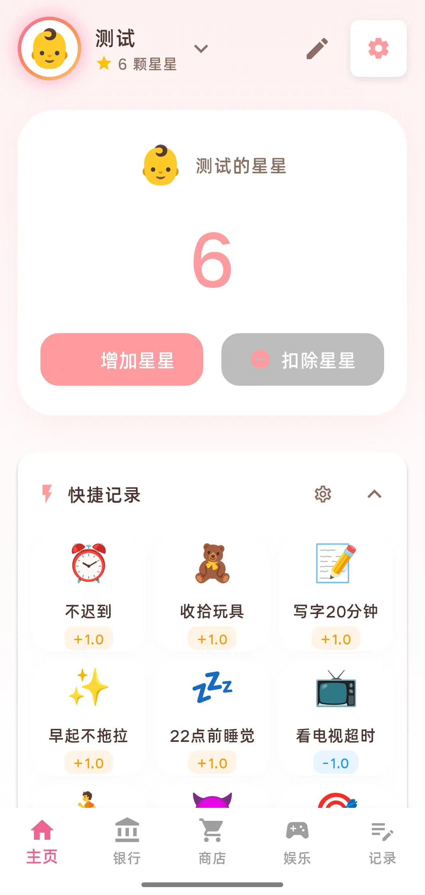
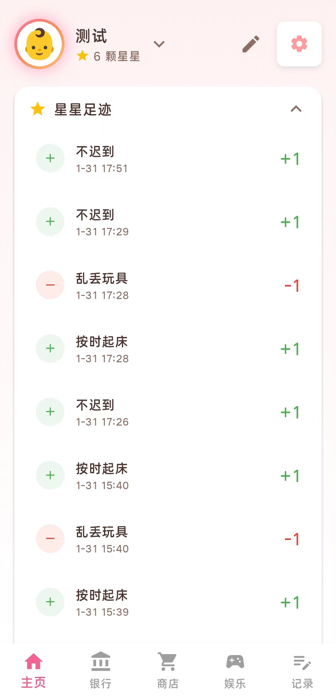
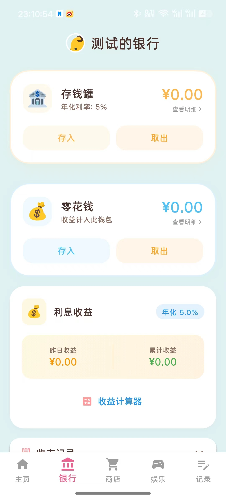
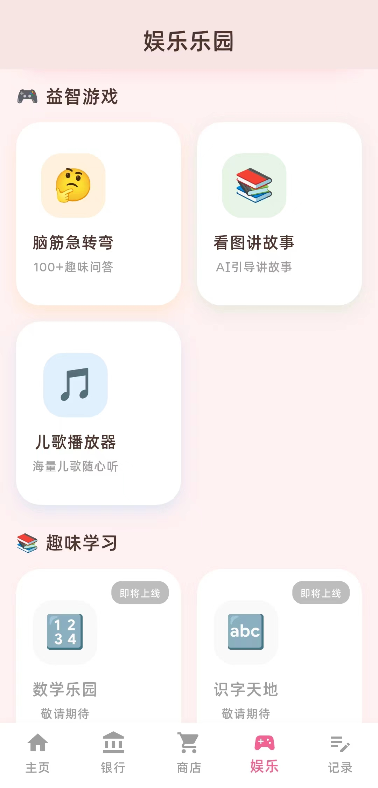
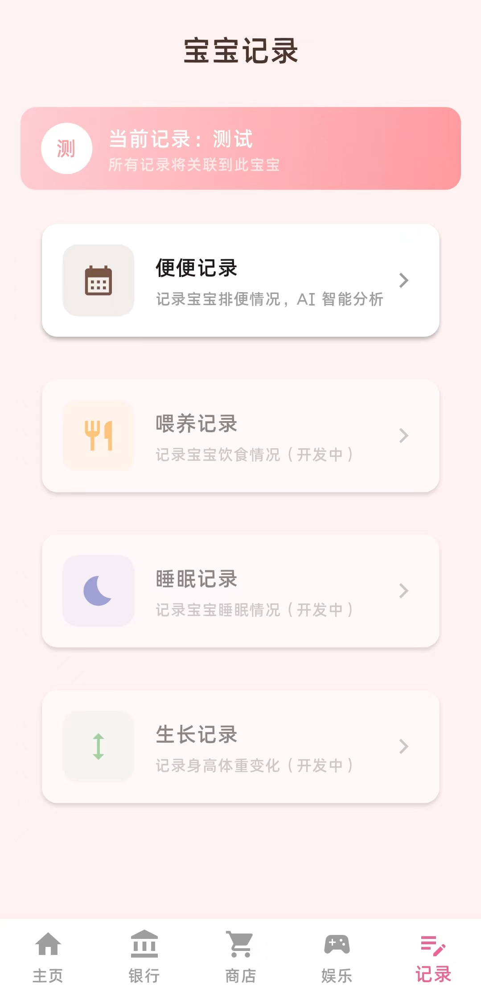
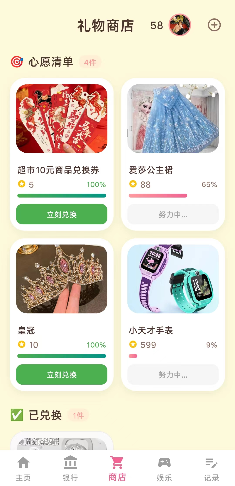

# ✨ Star Bank (星球银行)

一个充满趣味的家庭互动应用，旨在帮助家长通过奖励机制培养孩子的良好习惯，同时结合 AI 技术提供寓教于乐的互动体验。

应用基于 Flutter 开发，支持 Android 和 iOS 平台。

数据本地存储，支持 WebDAV 备份数据，保障数据安全。

## 🌟 核心功能

### 1. 🏦 星星奖励系统
- **行为记录**：家长可以方便地记录孩子的良好行为（获得星星）或待改进事项（扣除星星）。
- **存钱罐与零花钱**：模拟银行系统，星星可以兑换为存款，甚至产生利息，培养孩子的财商。
- **愿望清单**：孩子可以用积攒的星星兑换心仪的礼物。

### 2. 📖 AI 看图讲故事
- **智能识图**：基于 OpenAI Vision 模型，精准识别图片内容。
- **图库**：默认图库，支持自定义导入图库。
- **互动故事**：AI 化身老师，引导孩子根据图片发挥想象力讲故事，支持多轮对话。
- **语音交互**：集成语音识别 (STT) 和语音合成 (TTS)，实现自然的语音对话体验。
- **智能评价**：游戏结束后，AI 会根据故事内容的丰富度进行打分和点评，并自动奖励星星。

### 3. 🎵 娱乐中心
- **音乐播放器**：仅支持TuneHubAPI音乐接口，包含精美的播放界面、歌词显示和后台播放功能。
- **脑筋急转弯**：默认题库，支持自定义导入题库。

### 4. 🛠 实用工具
- **数据云同步**：内置 WebDAV 支持，可轻松备份和恢复数据，保障数据安全。
- **家长/儿童模式**：一键切换使用模式，防止孩子误操作敏感设置。
- **自动更新**：支持检测 GitHub Releases，实现应用内自动下载和更新。

## 📱 技术栈
- **框架**: Flutter
- **状态管理**: GetX
- **本地存储**: Hive
- **AI 服务**: OpenAI API (Chat & Vision)

---
*让成长更有趣，让教育更简单。*

部分截图:

