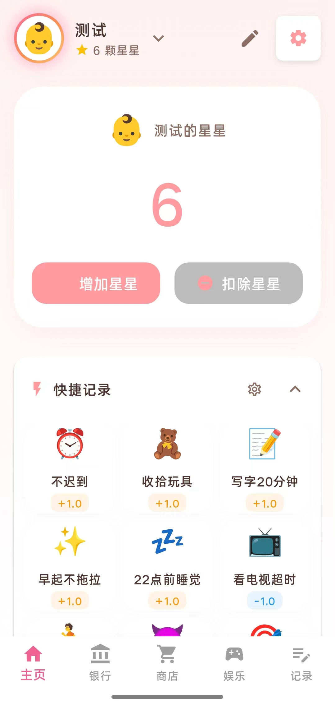
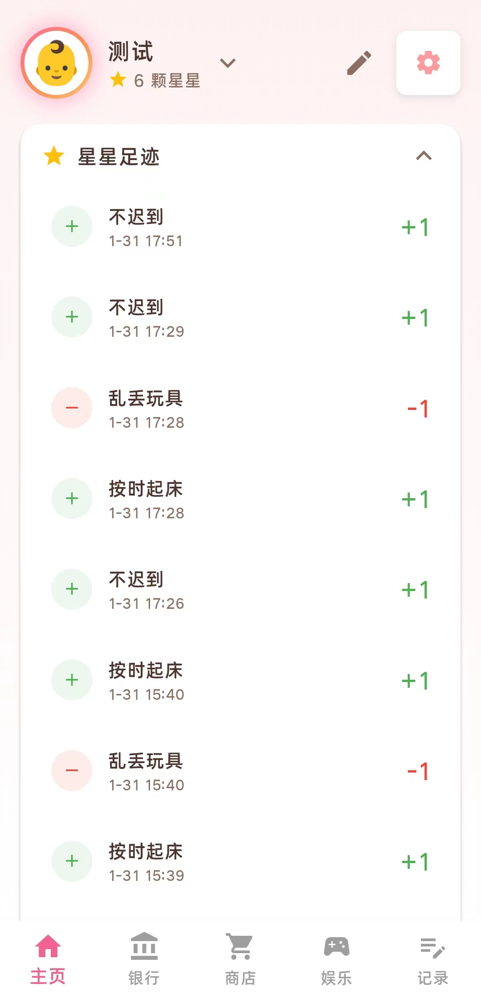
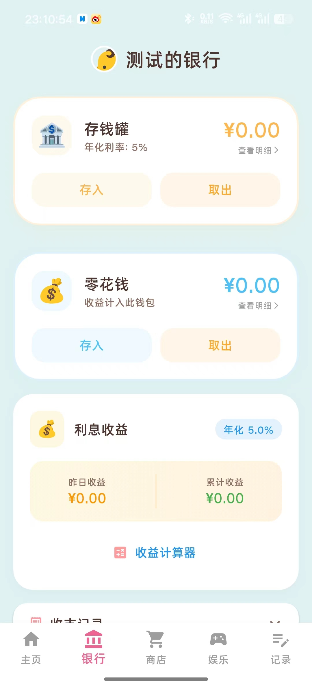
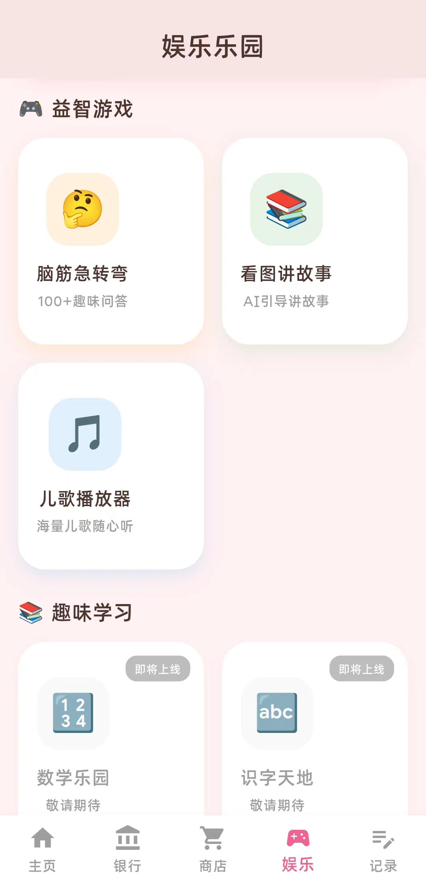
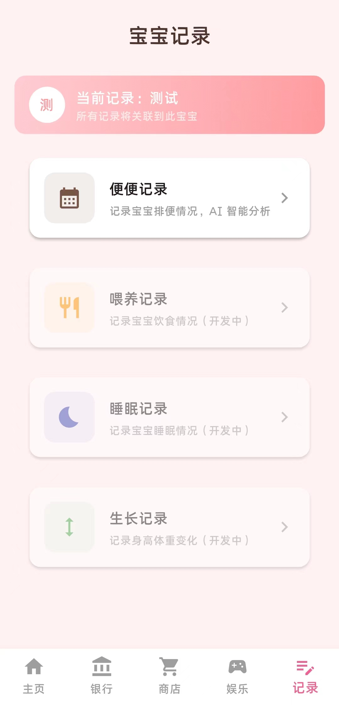
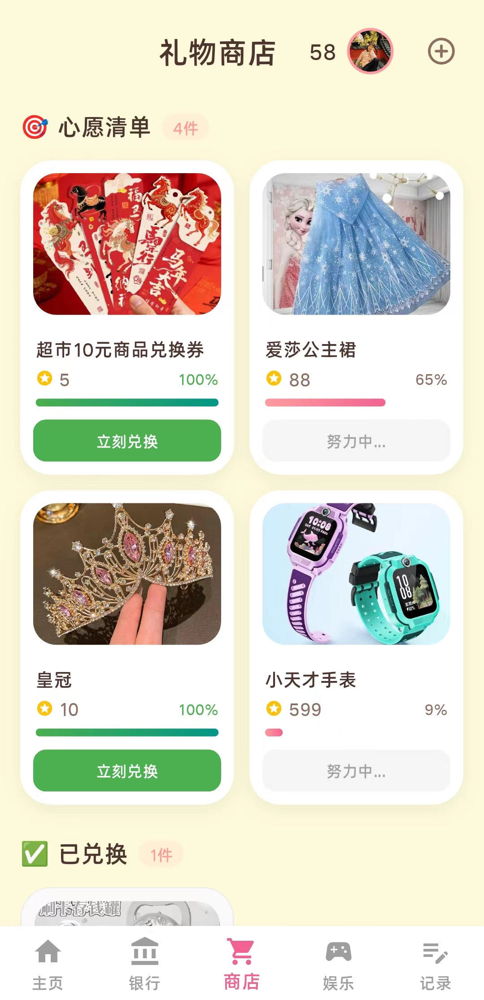

# ✨ Star Bank 

一个充满趣味的家庭互动应用，旨在帮助家长通过奖励机制培养孩子的良好习惯，同时结合 AI 技术提供寓教于乐的互动体验。

应用基于 Flutter 开发，支持 Android 和 iOS 平台。

数据本地存储，支持 WebDAV 备份数据，保障数据安全。

## 🌟 核心功能

### 1. 🏦 星星奖励系统
- **行为记录**：家长可以方便地记录孩子的良好行为（获得星星）或待改进事项（扣除星星）。
- **存钱罐与零花钱**：模拟银行系统，星星可以兑换为存款，甚至产生利息，培养孩子的财商。
- **愿望清单**：孩子可以用积攒的星星兑换心仪的礼物。

### 2. 📖 AI 看图讲故事
- **智能识图**：基于 OpenAI Vision 模型，精准识别图片内容。
- **图库**：默认图库，支持自定义导入图库。
- **互动故事**：AI 化身老师，引导孩子根据图片发挥想象力讲故事，支持多轮对话。
- **语音交互**：集成语音识别 (STT) 和语音合成 (TTS)，实现自然的语音对话体验。
- **智能评价**：游戏结束后，AI 会根据故事内容的丰富度进行打分和点评，并自动奖励星星。

### 3. 🎵 娱乐中心
- **音乐播放器**：仅支持TuneHubAPI音乐公益接口[TuneHub](https://tunehub.sayqz.com),包含精美的播放界面、歌词显示和后台播放功能。
- **脑筋急转弯**：默认题库，支持自定义导入题库。

### 4. 趣味学习
- **生活科学百科**：内置生活科学题库，二选一问答，AI 生成详细解析（一句话答案 + 原因 + 生活例子），支持 URL 远程导入题库和 AI 批量生成题目。
- **星海识字**： 内置了800+不同年龄儿童需要掌握的汉字，可配置专属字典库，使用AI生成有趣的识字故事，支持点读、朗读，并且在每一次的学习中会加入一定的新的文字
- **拼音小耳朵**：覆盖声母、韵母、整体认读音节，支持四声切读，配合词语练习，音频本地缓存，TTS 发音要领提示。
- **数学乐园**：计算器模式 + 练习题模式，按年级（1-6 年级）自动调整难度，支持竖式展示，TTS 朗读每次按键和结果。
### 5. 🛠 实用工具
- **数据云同步**：内置 WebDAV 支持，可轻松备份和恢复数据，保障数据安全。
- **家长/儿童模式**：一键切换使用模式，防止孩子误操作敏感设置。
- **自动更新**：支持检测 GitHub Releases，实现应用内自动下载和更新。
- **tts**：支持系统tts(系统级、第三方:multiTTS等)、自建tts(https://github.com/zuoban/tts)

### 6. 亲宝宝云相册
- **维护必读**：修改亲宝宝云相册、多端同步、回收站、永久删除或亲宝宝 WebDAV 数据源前，先读 [亲宝宝云相册维护说明](docs/baby_cloud_album_sync.md)。
- **独立云相册**：按当前宝宝和当前亲宝宝数据源独立展示照片、视频时间轴，支持软删除和回收站。
- **自定义媒体浏览器**：Android 优先支持从手机相册选择图片、视频，已上传媒体会按 SHA-256 哈希置灰并禁止重复提交；iOS 第一版暂不支持该自定义选择器。
- **后台上传队列**：上传任务支持进度展示、暂停、继续、重试、取消和清理已完成任务，离线任务可保留在队列中后续重试。
- **独立数据源**：亲宝宝 WebDAV 配置与系统设置里的 WebDAV 备份互不冲突，每个数据源、每个宝宝使用独立云端目录；阿里云盘入口已预留，第一版请使用亲宝宝 WebDAV。
- **记录模块增强**：成长记录和宝宝大事记放在「记录」模块，跟便便记录使用同一套主应用备份逻辑；支持截图 OCR 自动填入，且每个功能可独立选择 OpenAI 模型配置。
- **成长曲线参考**：成长记录按宝宝性别叠加 WHO 参考区间；身高覆盖 0-12 岁，体重覆盖 0-10 岁，头围覆盖 0-5 岁，超出范围仅展示个人曲线。

## 📱 技术栈
- **框架**: Flutter
- **状态管理**: GetX
- **本地存储**: Hive
- **AI 服务**: OpenAI API (Chat & Vision)

---
*让成长更有趣，让教育更简单。*

部分截图:

